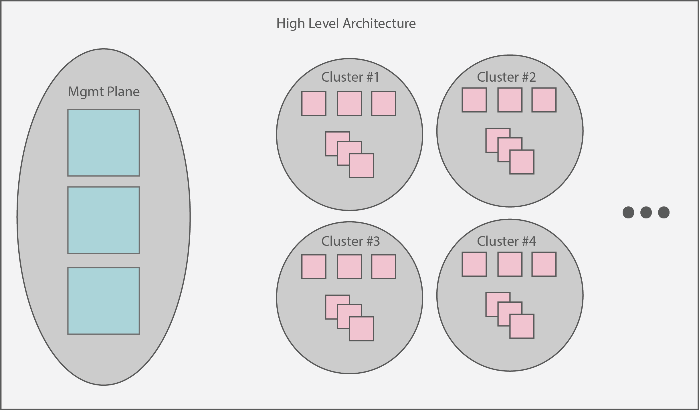

# Architecture

The overarching architecture of Sidero centers around a "management plane".
This plane is expected to serve as a single interface upon which administrators can create, scale, upgrade, and delete Kubernetes clusters.
At a high level view, the management plane + created clusters should look something like:

