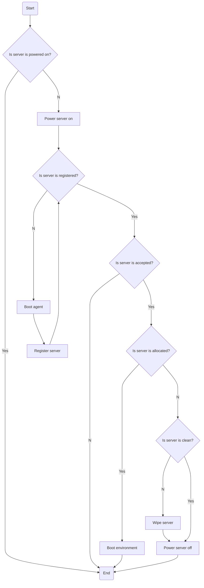
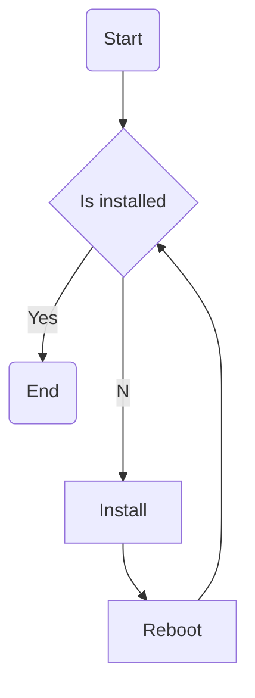

```mermaid
graph TD;
    Start(Start);
    End(End);

    %% Decisions

    IsOn{Is server is powered on?};
    IsRegistered{Is server is registered?};
    IsAccepted{Is server is accepted?};
    IsClean{Is server is clean?};
    IsAllocated{Is server is allocated?};

    %% Actions

    DoPowerOn[Power server on];
    DoPowerOff[Power server off];
    DoBootAgentEnvironment[Boot agent];
    DoBootEnvironment[Boot environment];
    DoRegister[Register server];
    DoWipe[Wipe server];

    %% Chart

    Start-->IsOn;
    IsOn--Yes-->End;
    IsOn--No-->DoPowerOn;

    DoPowerOn--->IsRegistered;

    IsRegistered--Yes--->IsAccepted;
    IsRegistered--No--->DoBootAgentEnvironment-->DoRegister;

    DoRegister-->IsRegistered;

    IsAccepted--Yes--->IsAllocated;
    IsAccepted--No--->End;

    IsAllocated--Yes--->DoBootEnvironment;
    IsAllocated--No--->IsClean;
    IsClean--No--->DoWipe-->DoPowerOff;

    IsClean--Yes--->DoPowerOff;

    DoBootEnvironment-->End;

    DoPowerOff-->End;
```

## Installation Flow

```mermaid
graph TD;
    Start(Start);
    End(End);

    %% Decisions

    IsInstalled{Is installed};

    %% Actions

    DoInstall[Install];
    DoReboot[Reboot];

    %% Chart

    Start-->IsInstalled;
    IsInstalled--Yes-->End;
    IsInstalled--No-->DoInstall;

    DoInstall-->DoReboot;

    DoReboot-->IsInstalled;
```
